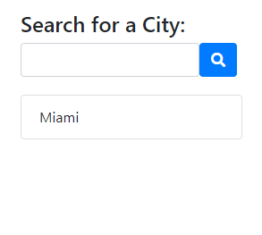
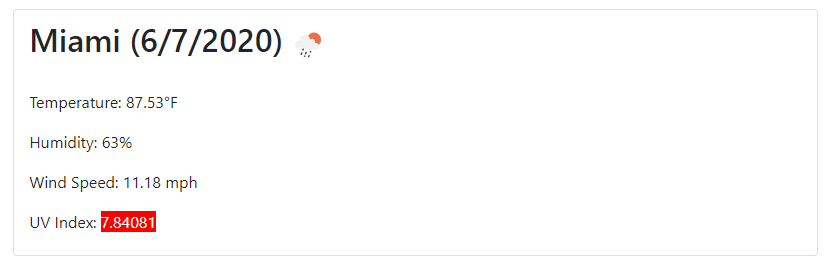
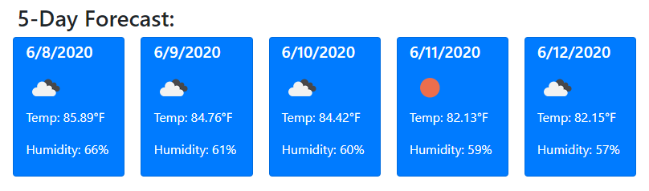

# Weather Dashboard 

## Purpose
An application that allows a user to search for weather information for a desired city

## Website
https://brandonljackson23.github.io/weather-app/

## Overview
When a user searches for a city, the current weather conditions are returned along with a 5-day forecast for future weather conditions.  The searched city is saved in the search history in case the user would like to return to see the weather of that city in the future.

## Features
Weather Info
A user can search weather conditions for over 200,000 cities.  The search results include the name of the city, current date, temperature (in degrees fahrenheit), humidity percentage, wind speed and UV index.  Further, the UV index is color-coded to indicated the severity of the conditions: red = high; yellow = moderate; and green = low.  An icon representing the current weather is also displayed for aesethics.

Below the current day weather conditions the user is presented with a forecast for the next 5 days.  It includes less information that the current day, but still displays the more critical information of date, weather icon, temperature and humidity.

Search History
Whenever a user searches a city the city is stored in localstorage and displayed in thier search history making it easy for a user to revisit a previously searched city with one-click of the mouse.

## Screenshots
Search and Search History

Current Day Results

Five Day Forecast

